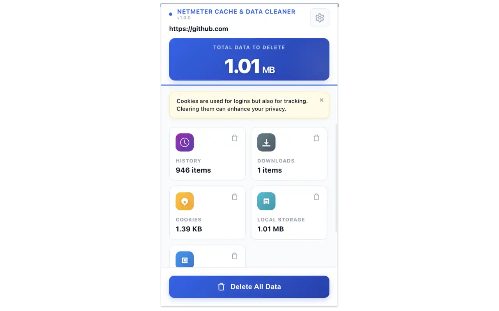

# NetMeter Extensions

A collection of high-performance, privacy-focused browser utilities designed for power users. Monitor your bandwidth consumption and manage site data with surgical precision.

---

## 📊 NetMeter Web
**Real-time Bandwidth Monitoring Extension**

Stay informed about exactly how much data websites are using. From high-definition video streams to background API calls, NetMeter Web breaks it all down in real-time.

### Key Features:
- **Granular Breakdown**: Categorizes data into Media, Images, Scripts, API Data, and more.
- **Real-time Monitoring**: Floating on-page monitor and dynamic extension badge.
- **Detailed Reports**: Analyze usage patterns by day, week, or month.

---

## 🧹 NetMeter Cache & Data Cleaner
**Surgical Site Data Management**

A powerful tool to analyze, monitor, and clean site-specific data. Take control of your browser storage without affecting your global sessions.

### Key Features:
- **Site-Specific Focus**: Manage data only for the active tab.
- **Advanced Inspector**: Drill down into Cookies, LocalStorage, and IndexedDB.
- **Granular Cleanup**: Delete individual items without a full "all-or-nothing" wipe.

---

## 🛠 Built With
- **TypeScript** & **Preact**: For high performance and tiny footprint.
- **esbuild**: For lightning-fast builds.
- **Privacy-First Architecture**: All processing happens locally on your device.

## 🔗 Links
- **Website**: [getnetmeter.com](https://getnetmeter.com)
- **Developer**: [Mkhuda](https://github.com/mkhuda)