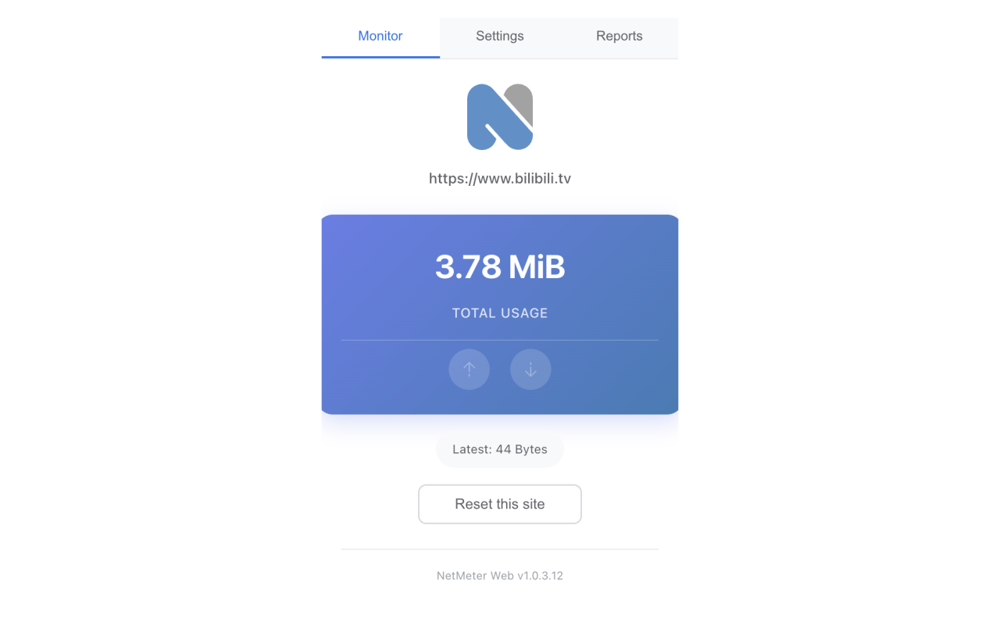
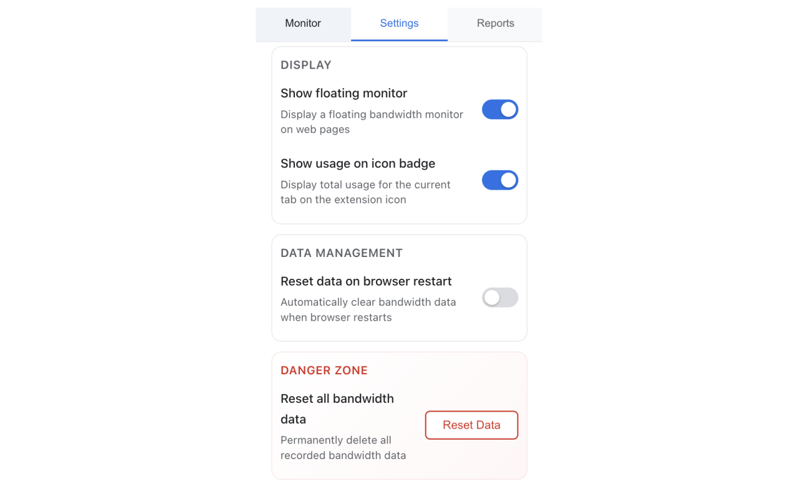
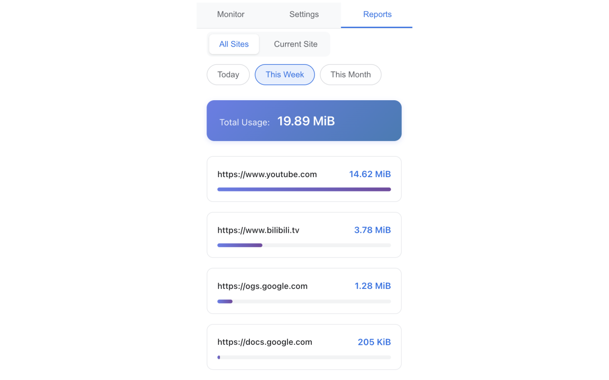
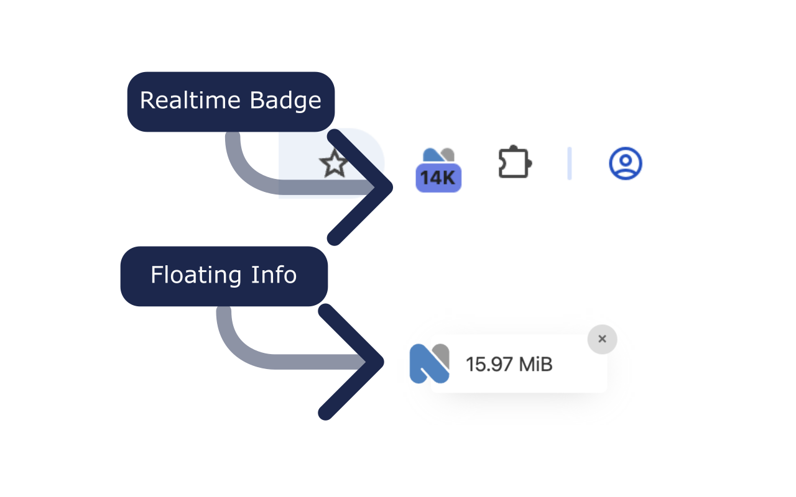

# NetMeter Web Extension

NetMeter is a lightweight and simple web extension designed to monitor your internet speed (upload and download) directly from your browser's toolbar. Keep track of your bandwidth usage in real-time, get detailed reports, and manage settings with ease.

## Features at a Glance

### Real-time Bandwidth Monitoring (Main Popup)

Get an instant overview of your current upload and download speeds directly from the extension's popup. Simple, clean, and always accessible.

### Intuitive Settings

Customize NetMeter to fit your needs. The settings tab in the popup allows you to adjust various parameters for a personalized monitoring experience.

### Comprehensive Usage Reports

Dive deeper into your internet usage with detailed reports. View bandwidth consumption for all sites or focus on the current site to understand your data flow.

### Floating Icon & Real-time Badge

For continuous monitoring, NetMeter offers a floating icon that displays real-time bandwidth. Plus, a subtle badge on the extension icon keeps you informed at a glance.

## Get NetMeter Today!

Enhance your browsing experience by keeping a close eye on your internet speed. Download the NetMeter Web Extension from the Chrome Web Store:

[**Download NetMeter Web Extension**](https://chromewebstore.google.com/detail/netmeter-web/jnjnledlnjnkfgepmadpfdljbmdhcihi)
